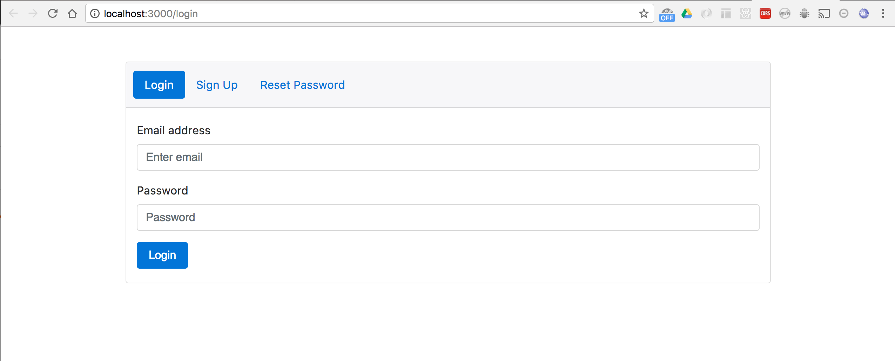
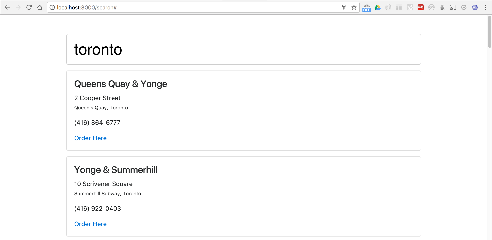
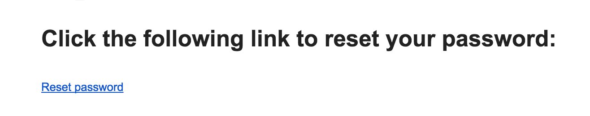
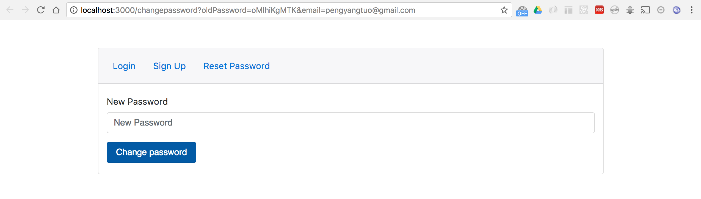

# LCBO client
This is front end application built to demonstrate the functionality supported by [LCBO master](https://github.com/pengyangtuo/lcbo-master)

This application is built with [React](https://facebook.github.io/react/) and [Redux](http://redux.js.org/docs/introduction/)

## Install and run
First install required npm modules: 
```bash
> npm install
```

Once all the dependencies modules are downloaded, start the app with:
```bash
> npm start
```
the site will be available at [http://localhost:3000](http://localhost:3000)


## Usage
The _Sign Up_ page allow you to register an account

Once an account has been created, the user will receive a welcome email, and he/she will be redirect to the search page where he/she can enter the address in search bar and view the nearby LCBO stores:


### reset password
if the user forgot their password, he/she can go to the _Reset Password_ page and put in the email address associated with their account. The application will send out an email contains a link that redirect the user back to the application and create a new password.

Sample email and the page from the email's link



